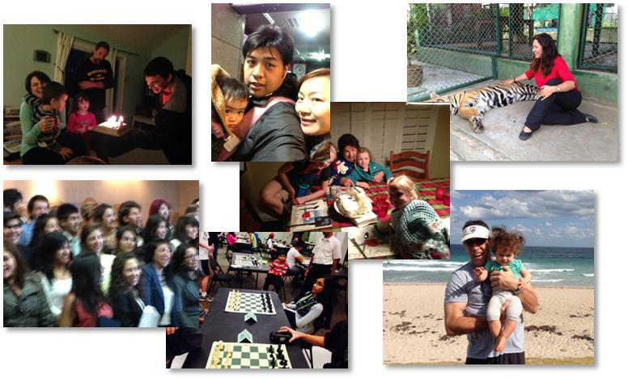
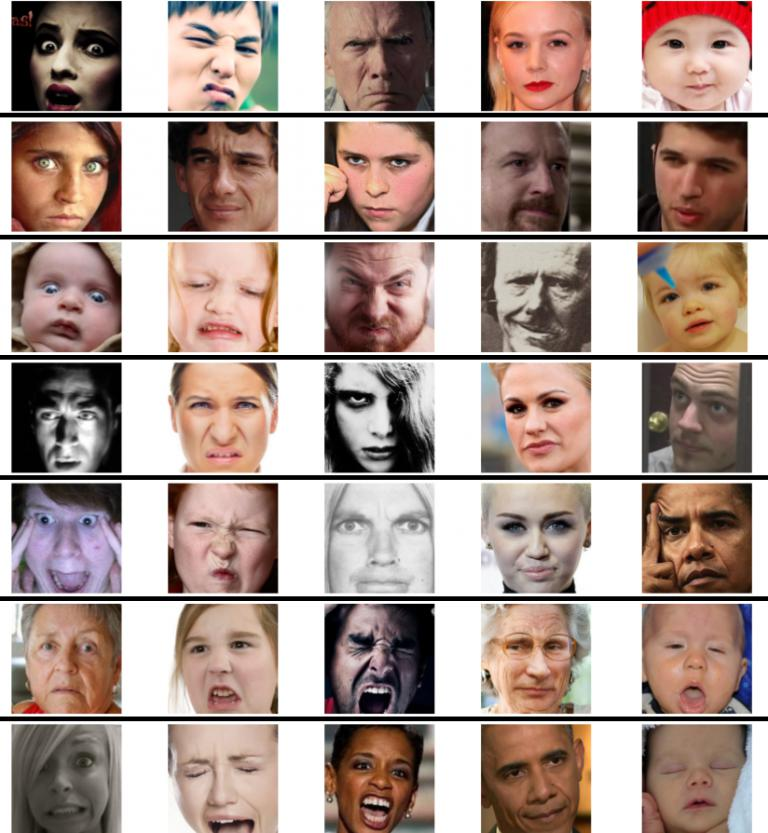
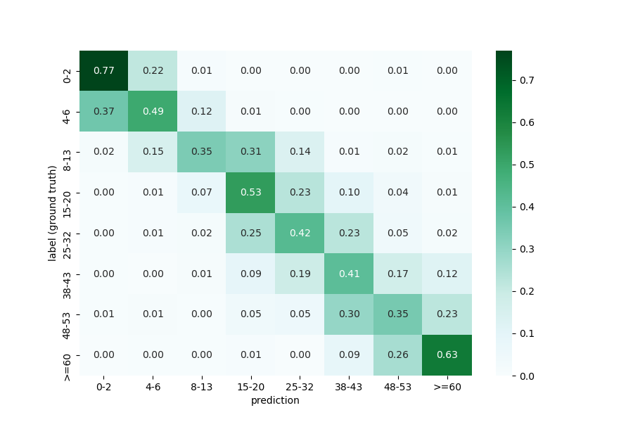
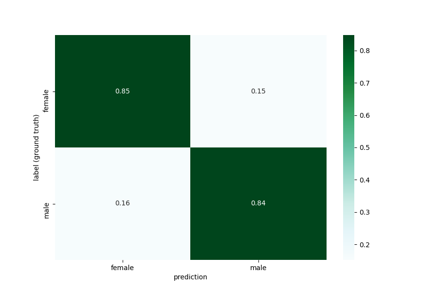
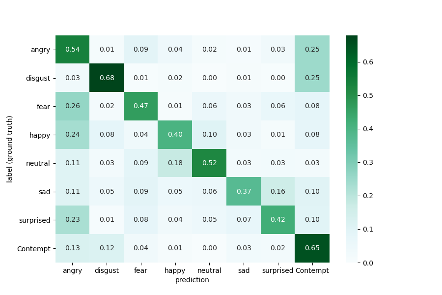

# Multitask learning for human age, gender and emotion

## Environment
- Python
- tensorflow
- opencv
- numpy

## Dataset
- Audience (age, gender)
  - Contains 26,580 photos across 2,284 subjects with a binary gender label and one label from eight different age groups, partitioned into five splits.

  


- AffectNet (emotion)
  - AffectNet is a large facial expression dataset with around 0.4 million images manually labeled for the presence of eight (neutral, happy, angry, sad, fear, surprise, disgust, contempt) facial expressions along with the intensity of valence and arousal. 



## Setup
After completely install environment, open command line and go to the folder where the project is.

```
python multitask_train.py
```

After training is finish, you can test the model by type in command below

```
python multitest.py
```

## Result



